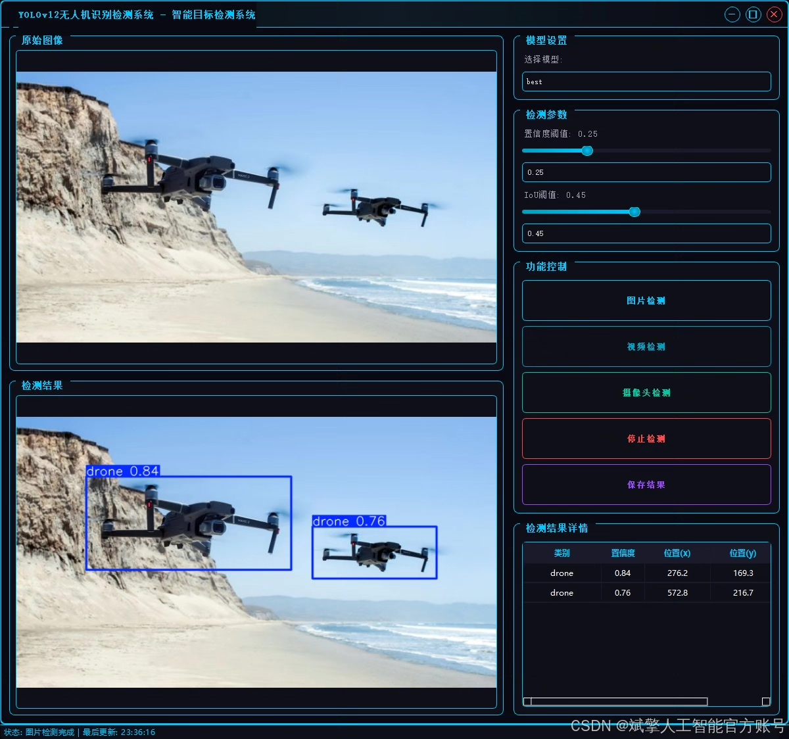
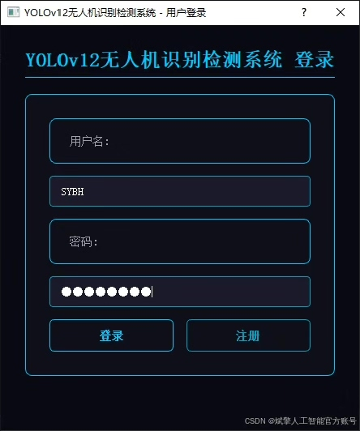
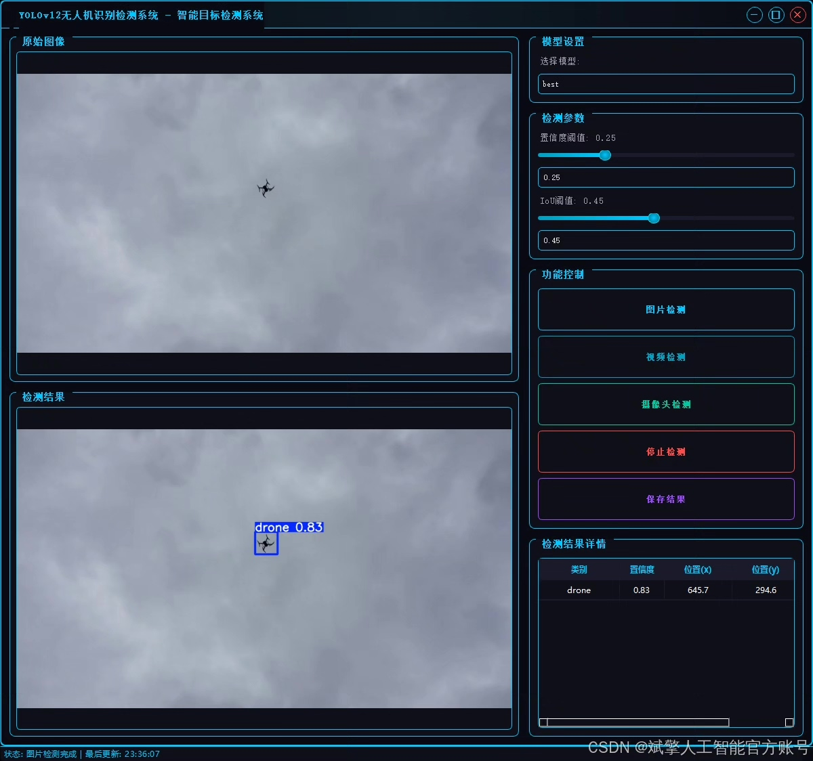
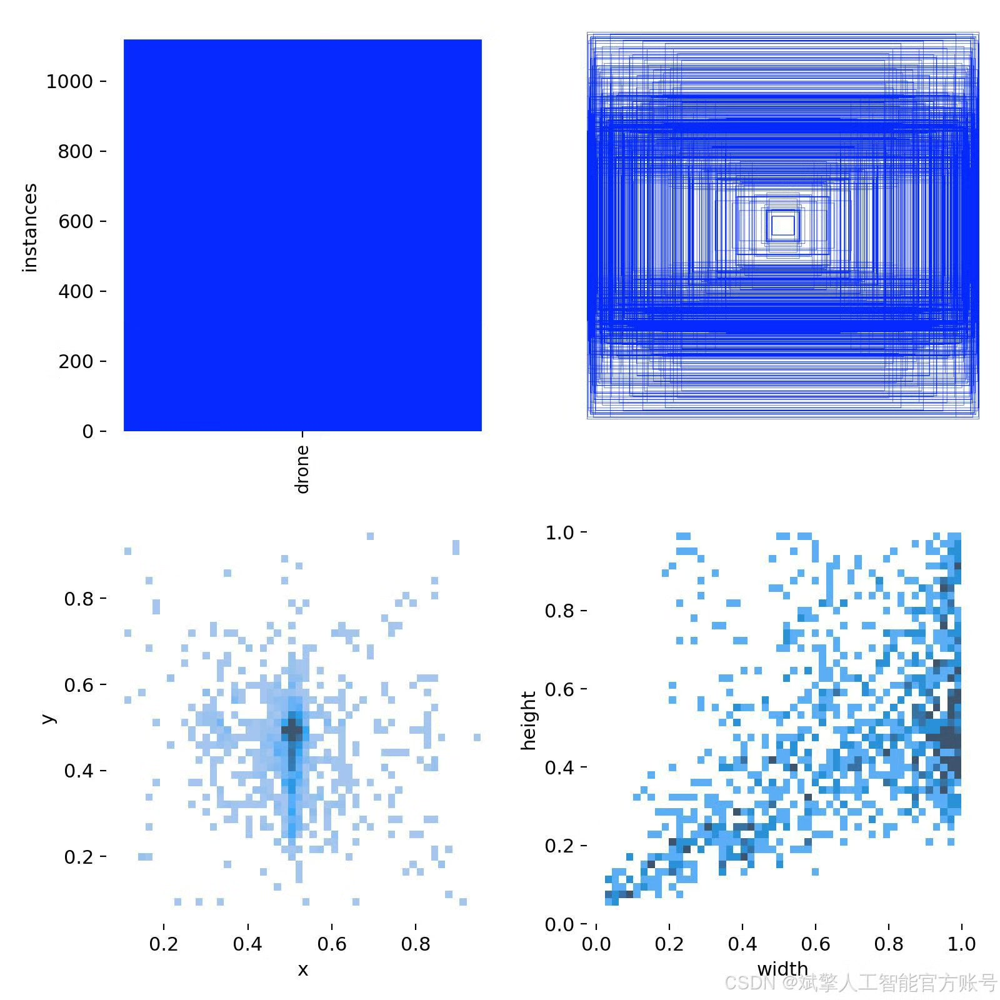
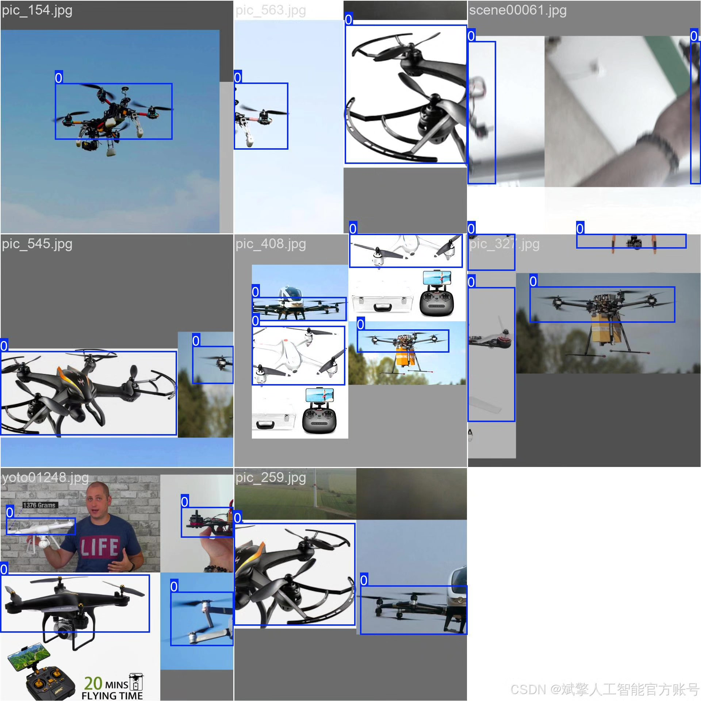
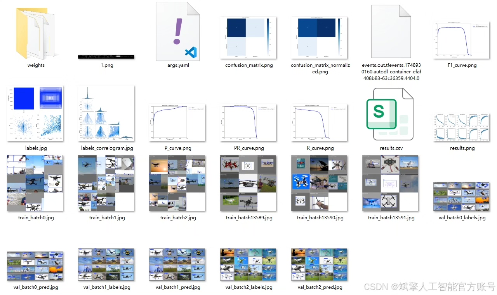
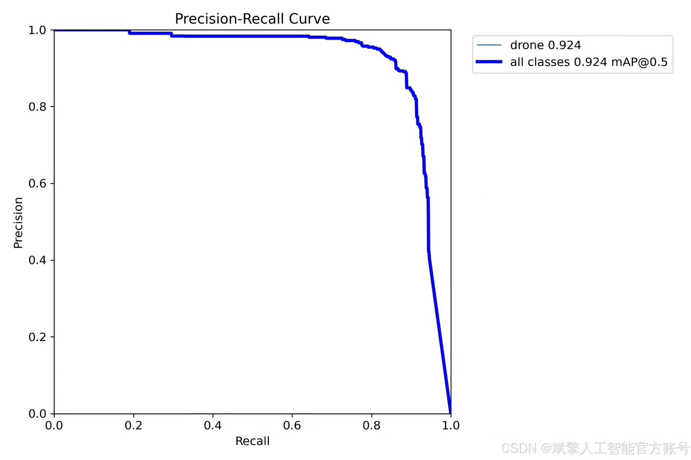
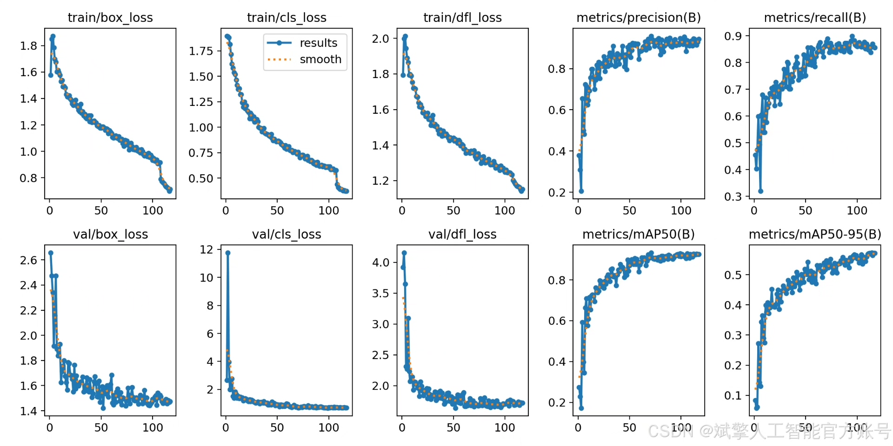
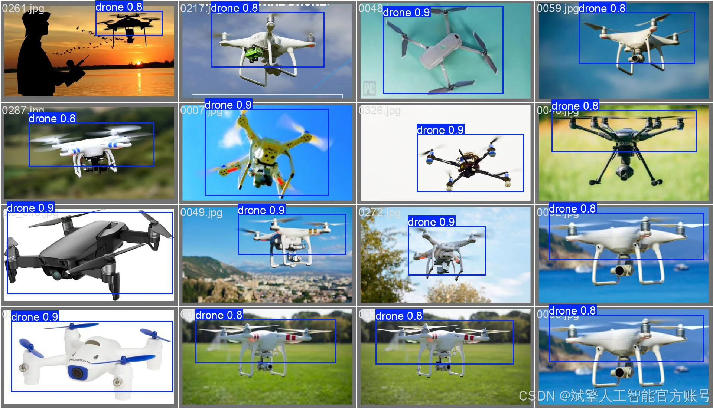

# YOLOv12 Drone Detection System

## Body

YOLOv12 Drone Detection System Based on Deep Learning YOLOv12: A Drone Recognition and Detection System (YOLOv12+YOLO Dataset+UI Interface+Login/Registration Interface+Python Project Source Code+Model)

This project is based on the YOLOv12 deep learning framework to develop an efficient drone target detection system, focusing on real-time recognition and localization of drone targets. The system primarily focuses on a single category ('drone') as the core detection task, significantly improving the detection accuracy and speed in complex scenarios through optimizing model structure and training strategies.

Dataset:
nc: 1 class,
name: ['drone'],
dataset quantity: 1012 training images, 347 validation images.

✅ User Login/Registration: Supports password verification and security validation.
✅ Three detection modes: Based on the YOLOv12 model, supports image, video, and real-time camera detection, accurately recognizing targets.
✅ Dual-screen comparison: Display original images and detection results simultaneously on the screen.
✅ Data visualization: Real-time table displaying the categories, confidence levels, and coordinates of detected targets.
✅ Intelligent parameter adjustment: Offers a confidence slide bar for dynamic optimization of detection accuracy to meet different scene requirements.
✅ Sci-fi style interface: Dark theme combined with dynamic light effects, reducing visual fatigue and enhancing operational experience.

## Images

## Payment

Here is a pay link on Stripe ( https://buy.stripe.com/3cs8yP7sY87d0vu9AB ). Please contact me lonlonago@foxmail.com after funding $89, and I will send you a complete data files , thank you!

